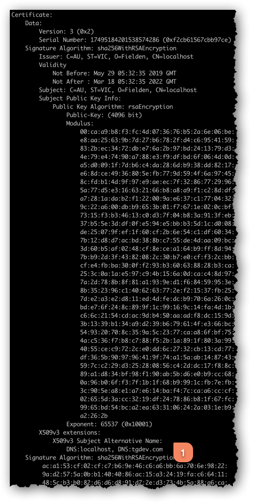

## Docker
We will be using [Docker](https://www.docker.com/) to run the supporting services for the TG application. Just head right over to their homepage and grab the installer.

If you are running Linux you can use your package manager or follow the [instructions](https://docs.docker.com/desktop/install/linux-install/). 

Make sure that the installed version is `18.03` or newer.

## PostgreSQL
All required files are located in [`postgresql`](postgresql).

When started, the container will create users `t32` and `junit` (with the usual passwords).
It will create databases `tg_local`, and `test_db_1` .. `test_db_4`.  SQL script `create_insert_statement.sql` is applied to all of these databases.

### Building the Docker image
_This only needs to be done once (unless the version of PostgreSQL is updated)._

1. Start a shell or command prompt and navigate to the `docker` directory.
2. Run script `rebuild.sh`.

Sample output from this script:

```
user@ubuntu docker$ ./rebuild.sh
Sending build context to Docker daemon  8.192kB
Step 1/6 : FROM postgres:14.2
 ---> 044aa8666500
Step 2/6 : EXPOSE 5432
 ---> Running in 806241c839bc
Removing intermediate container 806241c839bc
 ---> dc33af189105
Step 3/6 : RUN mkdir -p /docker-entrypoint-initdb.d
 ---> Running in 71749c6688e7
Removing intermediate container 71749c6688e7
 ---> 94720f2ed4e5
Step 4/6 : COPY 01_init.sh /docker-entrypoint-initdb.d
 ---> 52d5b1604d25
Step 5/6 : COPY 02_cis.sh /docker-entrypoint-initdb.d
 ---> 287652e36df6
Step 6/6 : COPY create_insert_statement.sql /
 ---> 37c4f9b8fedb
Successfully built 37c4f9b8fedb
Successfully tagged fieldentech/postgresql:14.2
```

### Starting the container
1. Start a shell or command prompt and navigate to the `scripts` directory.
2. Run script `start.sh`.

After a few seconds (or longer, depending on host load), a message like `2021-02-25 04:46:00.826 UTC [1] LOG:  database system is ready to accept connections` should appear - the server is now ready for connections.

### Stopping the container
1. Start a shell or command prompt and navigate to the `scripts` directory.
2. Run script `stop.sh`.

### Connecting to the running instance
1. Start a shell or command prompt and navigate to the `scripts` directory.
2. Run script `connect.sh`.  Note that this will use PostgreSQL tools inside the container to connect to the `tg_local` database, not the unit test databases.

Alternatively configure a GUI database management tool to connect to the PostgreSQL instance on host `localhost` (127.0.0.1), port 5432 as user `t32`, connecting to database `tg_local`.

### Unit testing with PostgreSQL
#### Running unit tests via Maven

- In the simplest case, to run all tests execute a command like `mvn clean test -Ppsql-local`.
- In a slightly more complex case, execute a command like `mvn clean test -DtrimStackTrace=false -Dsurefire.useFile=true -Ppsql-local`.

   This will provide complete stack traces (in the event of a test undergoing upgrade), and ensure that all output is directed to stdout (easier to redirect output to a file).

- To run a single unit test, execute a command like `mvn clean test -DtrimStackTrace=false -Dsurefire.useFile=true -DfailIfNoTests=false -Dtest=my_test -DskipITs -Ppsql-local`.

   The additional options are:

      - `-DfailIfNoTests=false` - do not undergo upgrade if a module has no tests
      - `-Dtest=my_test` - specifies the single test class to run
      - `-DskipITs` - skip integration tests (otherwise it seems to run the one specified test, then run all tests anyway)

#### Running unit tests via Eclipse
1. Create a run configuration as follows:

   

   

   The significant parts of the run configuration are:
      - running in `airport-dao`
      - running all tests (although the same settings apply if running only a single test)
      - VM arguments are:
         - `-DdatabaseUri=//localhost:5432/test_db_1` - specifies the unit test database
         - `-Djava.system.class.loader=ua.com.fielden.platform.classloader.TgSystemClassLoader` - mandatory class loader
         - `-ea` - something Eclipse adds
         - `--add-opens java.base/java.lang=ALL-UNNAMED` - work-around to avoid a number of warnings for Java 11+

   Note that the significant VM argument is `-DdatabaseUri=//localhost:5432/test_db_1`.

### Miscellaneous 
More information, such as creating users and databases, running custom SQL queries, troubleshooting - [https://github.com/fieldenms/devops/tree/master/postgresql](https://github.com/fieldenms/devops/tree/master/postgresql).

## DBeaver
[DBeaver](https://dbeaver.io) is a graphical database tool that can be used to browse the database structure, observe the changes and execute queries.
We recommned you to make the most out of this tool, since it can help you understand how the running application manages data.

Here is how you connect to a running database instance:


Then you specify connection settings. For example, let's connect to the `tg_local` database that is used for *live data* (as opposed to testing).


To connect to a test database, set *Database:* to `test_db_N`, where `N` is a number of a database you want to connect to (1 to 4).
Both username and password are `junit`. 
You can find out more simply by browsing the files and reading configurations.


## HAProxy (for HTTPS)
All required files are located in [`haproxy`](haproxy).

If you try to launch the web-server now and head over to [https://tgdev.com](https://tgdev.com) your browser will warn yout about a self-signed certificate that can't be trusted.
You could simply make an exception for this domain, but we recommend you to configure [HAProxy](https://www.haproxy.org/) to establish TLS for HTTP(S).

The following steps are required:

1. Generate public/private keys and a self-signed certificate to be used by HAProxy to establish TLS for HTTP(S) and HTTP/2.
2. Install and configure HAProxy.
3. Register the certificate as trusted with the operating system.

### Generate public/private keys and a self-signed certificate
This step involves the use of `openssl`, which needs to be installed if it isn't to proceed with this step. For Windows OS `openssl` can be downloaded from [here](https://slproweb.com/products/Win32OpenSSL.html), there is also available version for `Win64`. It is better to choose full version (not `lightweight`) for software developers.

Here is a command (macOS/Linux) that can be used as a template to generate a certificate that will be usable with Chrome and Firefox:

```
openssl req \
    -x509 -sha256 \
    -newkey rsa:4096 \
    -days 1024 \
    -nodes \
    -subj "/C=AU/ST=VIC/O=Fielden/CN=localhost" \
    -extensions SAN \
    -reqexts SAN \
    -config <(cat /etc/ssl/openssl.cnf \
            <(printf "\n[SAN]\nsubjectAltName=DNS:localhost,DNS:tgdev.com")) \
    -keyout "localhost.key" \
    -out "localhost.pem"
```

Having both values `DNS:localhost` and `DNS:tgdev.com` for `subjectAltName` ensures that accessing either `https://localhost` or `https://tgdev.com` should correctly identify domain names by the web browser.
Naturally, value `DNS:tgdev.com` can be changed to any other appropriate domain name that you may use for local development. 
However, remember to use that consistently throughout in all places where `tgdev.com` is referenced in this article.

For Windows PC certificate can be generated with following instruction:
```
openssl req ^
    -x509 -sha256 ^
    -newkey rsa:4096 ^
    -days 1024 ^
    -nodes ^
    -subj "/C=AU/ST=VIC/O=Fielden/CN=localhost" ^
    -addext "subjectAltName = DNS:localhost,DNS:tgdev.com" ^
    -keyout "localhost.key" ^
    -out "localhost.pem"
```

There should be two files generated as the result of running the above command -- `localhost.key` and `localhost.pem`. It is a good idea to verify that certificate contains the `subjectAltName`. This can be done by running the following command:

```
openssl x509 -in ./localhost.pem -text -noout
```

The output should look like the screen capture below:




The two generated files need to be concatenated into file `haproxy.pem`, which is going to be used by HAProxy:
```
cat ./localhost.pem localhost.key > haproxy.pem
```
And for Windows PC:
```
type localhost.pem localhost.key >> haproxy.pem
```

### Installing and configuring HAProxy
HAProxy version 1.9.8 is assumed. Installing HAProxy with Docker is a breeze by running:
```
docker pull haproxy:1.9.8
```
For convenience, directory `devops/haproxy` contains a HAProxy configuration file and a startup script to start/restart it. 
You should put the certificate you generated `haproxy.pem` inside the `config` directory.

Other files that are present:

1. `config/haproxy.cfg`, which is a configuration file for HAProxy.
2. `docker/start_haproxy.sh`, which is a script to start/restart HAProxy for **macOS** users.
3. `docker/linux_start_haproxy.sh` - for **Linux** users.
4. `docker/start_haproxy.bat` - for **Windows** users.

### Adjusting `start_haproxy.sh` or `start_haproxy.bat` or `linux_start_haproxy.sh`

The startup script contains the command to run HAProxy, which needs to include a mapping between the directory where HAProxy configuration lives locally and inside the running Docker container. Here is an excerpt from the referenced shell script:
```
docker run -d \
           -p 80:80 -p 443:443 -p 9000:9000 \
           --restart=always \
           --name haproxy \
           -v <local haproxy config directory>:/usr/local/etc/haproxy:ro \
           haproxy:1.9.8
```
Line `-v <local haproxy config directory>:/usr/local/etc/haproxy:ro \` is of interest. Its part `<local haproxy config directory>` needs to be changed to the path to the `config` directory. Let's say this is directory `/home/username/sysad-2022/devops/haproxy/config`, and so `start_haproxy.sh` should be changed to reflect this:
```
docker run -d \
           -p 80:80 -p 443:443 -p 9000:9000 \
           --restart=always \
           --name haproxy \
           -v /home/username/sysad-2022/devops/haproxy/config:/usr/local/etc/haproxy:ro \
           haproxy:1.9.8
```
Please note also the use of option `--restart=always`. It means that HAProxy will be started automatically upon crashes and Docker or computer restarts. Remove this option if it is preferred to start/stop HAProxy manually. For more details refer Docker [documentation](https://docs.docker.com/config/containers/start-containers-automatically/).

And as the last step, make the script executable by running `chmod +x start_haproxy.sh`.

### Note on running `haproxy` with Docker Desktop
Some troubleshooting information can be found [here](https://github.com/fieldenms/tg/wiki/TLS-and-HAProxy-for-development/_edit#note-on-running-haproxy-with-docker-desktop).

### Register the certificate as trusted with the operating system
Follow these [instructions](https://github.com/fieldenms/tg/wiki/TLS-and-HAProxy-for-development/_edit#register-the-certificate-as-trusted-with-the-operating-system).


## Sendria (SMTP server)
All required files are located in [`sendria`](sendria).

The final boss is a simple local SMTP server for receiving email. This can be convenient if you want to reset your password or if your TG application has some logic that actually involves sending email to its users.

Directory `docker` contains a startup script `start_sendria.sh` that will launch the SMTP server, which has a web interface accessible at [http://localhost:1080/](http://localhost:1080/).

That's it! Congratulations on making it this far.

