## Docker
We will be using [Docker](https://www.docker.com/) to run the supporting services for the TG application. Just head right over to their homepage and grab the installer.

If you are running Linux you can use your package manager or follow the [instructions](https://docs.docker.com/desktop/install/linux-install/). 

Make sure that the **engine** version is `18.03` or newer. Note that engine version is different from Docker Desktop version.

## PostgreSQL
All required files are located in [`postgresql`](postgresql).

When started, the container will create users `t32` and `junit` (with the usual passwords).
It will create databases `tg_local`, and `test_db_1` .. `test_db_4`.  SQL script `create_insert_statement.sql` is applied to all of these databases.

### Building the Docker image
_This only needs to be done once (unless the version of PostgreSQL is updated)._

1. Start a shell or command prompt and navigate to the `docker` directory.
2. Run script `rebuild.sh` (macos/Linux) or `rebuild.bat` (Windows).

Sample output from this script:

```
user@ubuntu docker$ ./rebuild.sh
Sending build context to Docker daemon  8.192kB
Step 1/6 : FROM postgres:14.2
 ---> 044aa8666500
Step 2/6 : EXPOSE 5432
 ---> Running in 806241c839bc
Removing intermediate container 806241c839bc
 ---> dc33af189105
Step 3/6 : RUN mkdir -p /docker-entrypoint-initdb.d
 ---> Running in 71749c6688e7
Removing intermediate container 71749c6688e7
 ---> 94720f2ed4e5
Step 4/6 : COPY 01_init.sh /docker-entrypoint-initdb.d
 ---> 52d5b1604d25
Step 5/6 : COPY 02_cis.sh /docker-entrypoint-initdb.d
 ---> 287652e36df6
Step 6/6 : COPY create_insert_statement.sql /
 ---> 37c4f9b8fedb
Successfully built 37c4f9b8fedb
Successfully tagged fieldentech/postgresql:14.2
```

Windows users should run the script without the preceding `./`, i.e., just type `rebuild.bat`.

### Starting the container
1. Start a shell or command prompt and navigate to the `scripts` directory.
2. Run script `start.sh` (macos/Linux) or `start.bat` (Windows).

After a few seconds (or longer, depending on host load), a message like `2021-02-25 04:46:00.826 UTC [1] LOG:  database system is ready to accept connections` should appear - the server is now ready for connections.

### Stopping the container
1. Start a shell or command prompt and navigate to the `scripts` directory.
2. Run script `stop.sh` / `stop.bat`.

### Connecting to the running instance
1. Start a shell or command prompt and navigate to the `scripts` directory.
2. Run script `connect.sh` / `connect.bat`.  Note that this will use PostgreSQL tools inside the container to connect to the `tg_local` database, not the unit test databases.

Alternatively configure a GUI database management tool to connect to the PostgreSQL instance on host `localhost` (127.0.0.1), port 5432 as user `t32`, connecting to database `tg_local`.

### Unit testing with PostgreSQL
#### Running unit tests via Maven

- In the simplest case, to run all tests execute a command like `mvn clean test -Ppsql-local`.
- In a slightly more complex case, execute a command like `mvn clean test -DtrimStackTrace=false -Dsurefire.useFile=true -Ppsql-local`.

   This will provide complete stack traces (in the event of a test undergoing upgrade), and ensure that all output is directed to stdout (easier to redirect output to a file).

- To run a single unit test, execute a command like `mvn clean test -DtrimStackTrace=false -Dsurefire.useFile=true -DfailIfNoTests=false -Dtest=my_test -DskipITs -Ppsql-local`.

   The additional options are:

      - `-DfailIfNoTests=false` - do not undergo upgrade if a module has no tests
      - `-Dtest=my_test` - specifies the single test class to run
      - `-DskipITs` - skip integration tests (otherwise it seems to run the one specified test, then run all tests anyway)

#### Running unit tests via Eclipse
1. Create a run configuration as follows:

   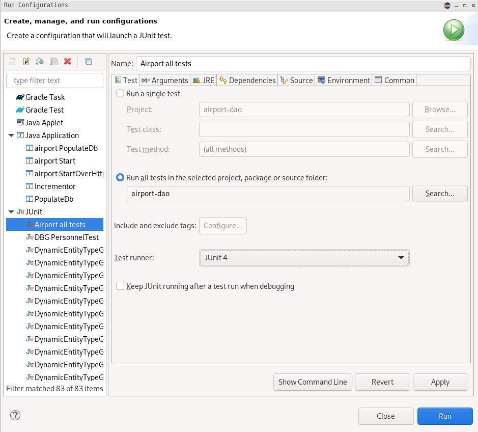

   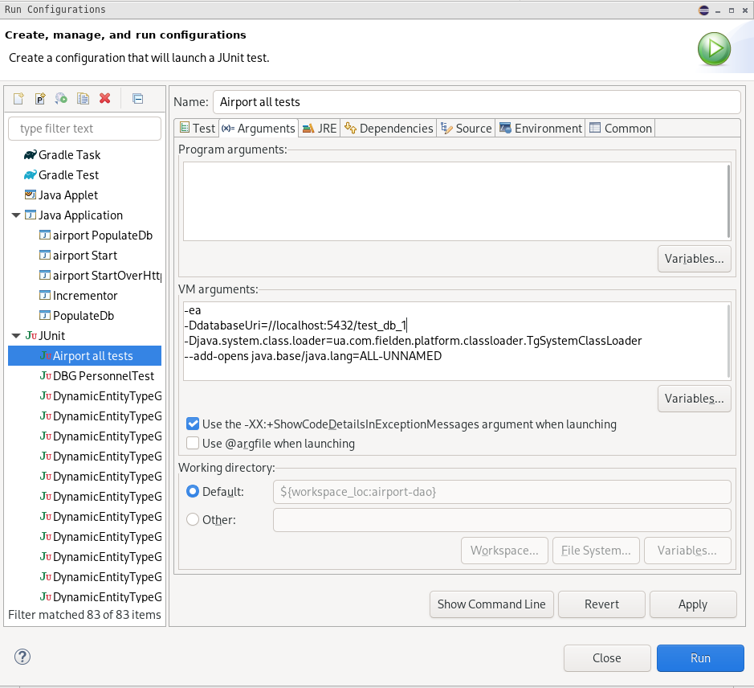

   The significant parts of the run configuration are:
      - running in `airport-dao`
      - running all tests (although the same settings apply if running only a single test)
      - VM arguments are:
         - `-DdatabaseUri=//localhost:5432/test_db_1` - specifies the unit test database
         - `-Djava.system.class.loader=ua.com.fielden.platform.classloader.TgSystemClassLoader` - mandatory class loader
         - `-ea` - something Eclipse adds
         - `--add-opens java.base/java.lang=ALL-UNNAMED` - work-around to avoid a number of warnings for Java 11+

   Note that the significant VM argument is `-DdatabaseUri=//localhost:5432/test_db_1`.

### Miscellaneous 
More information, such as creating users and databases, running custom SQL queries, troubleshooting - [here](postgresql/misc.md).

## HAProxy (for HTTPS)
All required files are located in [`haproxy`](haproxy).

If you try to launch the web-server now and head over to [https://tgdev.com](https://tgdev.com) your browser will warn yout about a self-signed certificate that can't be trusted.
You could simply make an exception for this domain, but we recommend you to configure [HAProxy](https://www.haproxy.org/) to establish TLS for HTTP(S).

The following steps are required:

1. Install and configure HAProxy.
2. Register the certificate as trusted with the operating system.

### 1a. Installing and configuring HAProxy
HAProxy version 1.9.8 is assumed. Installing HAProxy with Docker is a breeze by running:
```
docker pull haproxy:1.9.8
```
For convenience, directory `devops/haproxy` contains a HAProxy configuration file and a startup script to start/restart it. 
You should put the certificate `haproxy.pem` inside the `config` directory.

Other files that are present:

1. `config/haproxy.cfg`, which is a configuration file for HAProxy.
2. `docker/start_haproxy.sh`, which is a script to start/restart HAProxy for **macOS** users.
3. `docker/linux_start_haproxy.sh` - for **Linux** users.
4. `docker/start_haproxy.bat` - for **Windows** users.

### 1b. Adjusting `start_haproxy.sh` or `start_haproxy.bat` or `linux_start_haproxy.sh`

The startup script contains the command to run HAProxy, which needs to include a mapping between the directory where HAProxy configuration lives locally and inside the running Docker container. Here is an excerpt from the referenced shell script:
```
docker run -d \
           -p 80:80 -p 443:443 -p 9000:9000 \
           --restart=always \
           --name haproxy \
           -v <local haproxy config directory>:/usr/local/etc/haproxy:ro \
           haproxy:1.9.8
```
Line `-v <local haproxy config directory>:/usr/local/etc/haproxy:ro \` is of interest. Its part `<local haproxy config directory>` needs to be changed to the path to the `config` directory. Let's say this is directory `/home/username/sysad-2022/devops/haproxy/config`, and so `start_haproxy.sh` should be changed to reflect this:
```
docker run -d \
           -p 80:80 -p 443:443 -p 9000:9000 \
           --restart=always \
           --name haproxy \
           -v /home/username/sysad-2022/devops/haproxy/config:/usr/local/etc/haproxy:ro \
           haproxy:1.9.8
```
Please note also the use of option `--restart=always`. It means that HAProxy will be started automatically upon crashes and Docker or computer restarts. Remove this option if it is preferred to start/stop HAProxy manually. For more details refer Docker [documentation](https://docs.docker.com/config/containers/start-containers-automatically/).

And as the last step, make the script executable by running `chmod +x start_haproxy.sh`.

#### Note on running `haproxy` with Docker Desktop
When running haproxy via Docker Desktop the error might happen. The error is in the screenshot in the red rectangle.

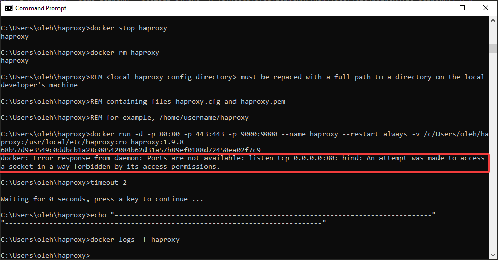

There are two possible solutions:

* As it can be seen from screenshot the problem is port `80` which for some reasons can not be accessed. In that case this port can be changed and `haproxy` run script should look like this:
 ```
 docker run -d ^
            -p 8080:80 -p 443:443 -p 9000:9000^
            --restart=always^
            --name haproxy^
            -v /c/Users/username/haproxy:/usr/local/etc/haproxy:ro^
            haproxy:1.9.8
 ```
* Another solution requires to find the application that listens port `80` which makes it inaccessible for Docker. It might be another web server or IIS etc. `netstat -aon |find ":80"` will help to find `PID` of application that does it. It could be a case when `PID` of application is `4` which is the `SYSTEM`, then you may turn it off [this post](https://superuser.com/questions/352017/pid4-using-port-80) describes how to do that. But it might be a bit dangerous as it requires to edit register.

When first time running `haproxy` you should share it with Docker Desktop. After that you can stop, start or restart it using GUI like on the picture below

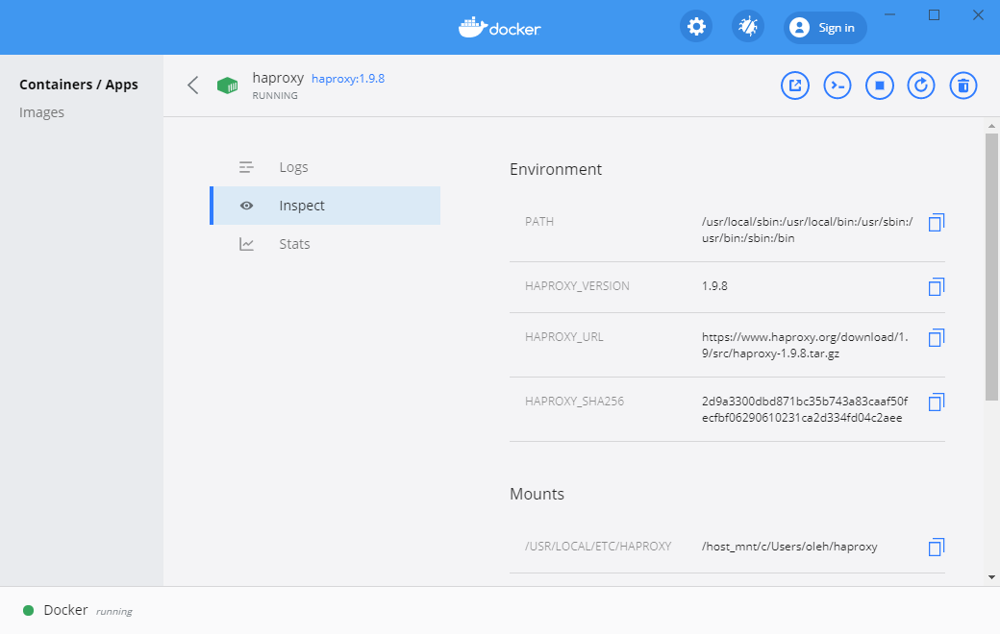.


### 3. Register the certificate as trusted with the operating system

Now everything should be ready for us to start a TG app behind HAProxy. And this is required so that we could obtain the certificate from Chrome to register it as trusted with OS.

Ordinarily the order in which TG app and HAProxy are started hardly matters. However, for the first time it highly recommended to first start a TG app and then, only after it is fully loaded, start HAProxy by running `./start_haproxy.sh`.

**Please note that TG app must be started in HTTP mode, not HTTPS.** That is, use `StartOverHttp`, rather than `Start`.
Make sure that the following lines appear in the console (e.g. Eclipse console) before starting HAProxy:
```
Starting the Jetty [HTTP/1.1] server on port 8091
Starting fielden.webapp.WebUiResources application
```

If HAProxy starts with an alert about `tgdev` having no server available, as depicted in the screen capture below, then either the TG app has not started or HAProxy binding on line 104 was not correctly updated. In that case please re-read section "Adjusting `haproxy.cfg`" above and make sure it is followed properly.

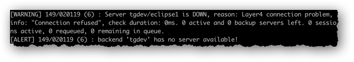

Assuming that HAProxy started without the above alert, open Chrome and load `https://tgdev.com/login`.

Regardless of the OS you're using, the result should look like the screen capture below. Open the Developer Tools and switch to the Security tab.

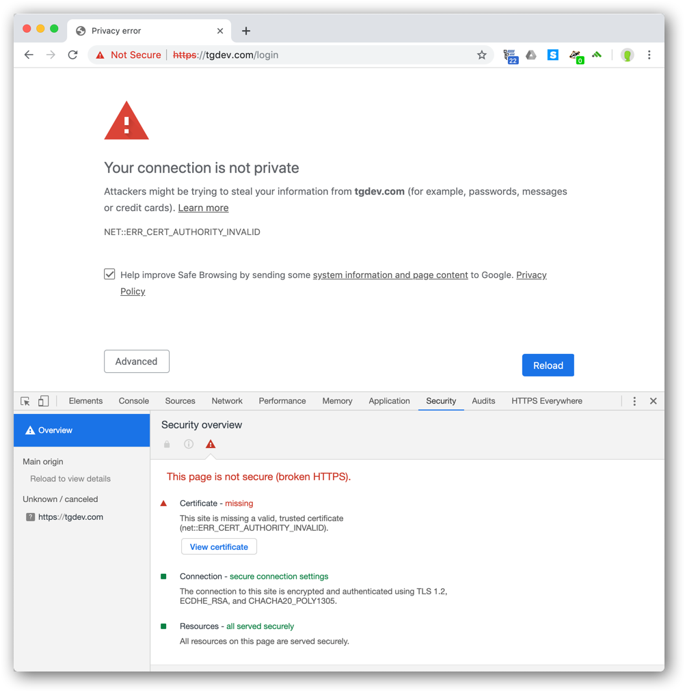

The steps to make our certificate trusted are different for macOS and Ubuntu. Let's start with macOS.

### Making certificate trusted in macOS
Click "View certificate" button as indicated with label 1 in the screen capture below -- a certificate dialog is opened.

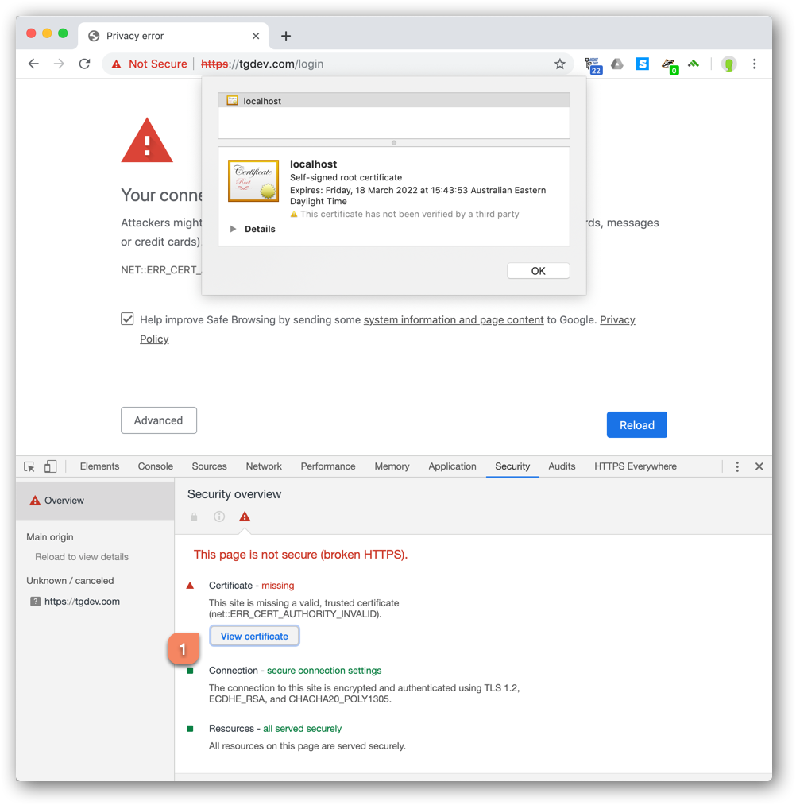

Drag the certificate icon from the dialog to some directory in Finder. This should create file `localhost.cer` on that folder.

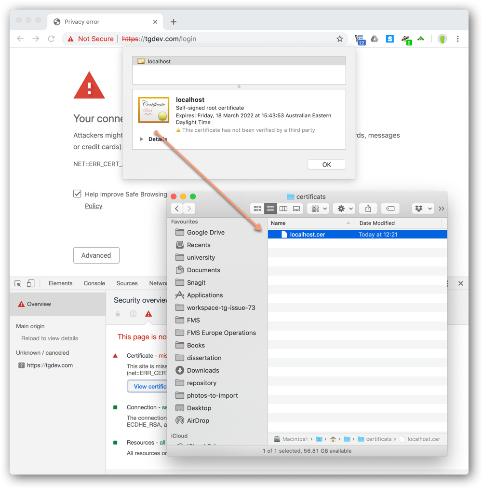

Double click that file to open it in the Keychain Access application (this will prompt for a system password). The following screen capture shows the result of this after selecting category "Certificates" in this application to see only certificates. As you can see entry "localhost" is present.

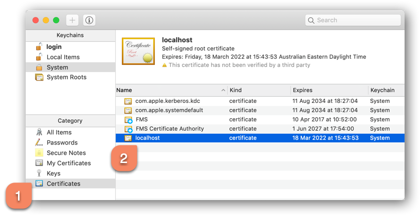

Double click entry "localhost" in the Keychain Access window, and mark it as "Always Trusted" under "Trust", option "When using this certificate".

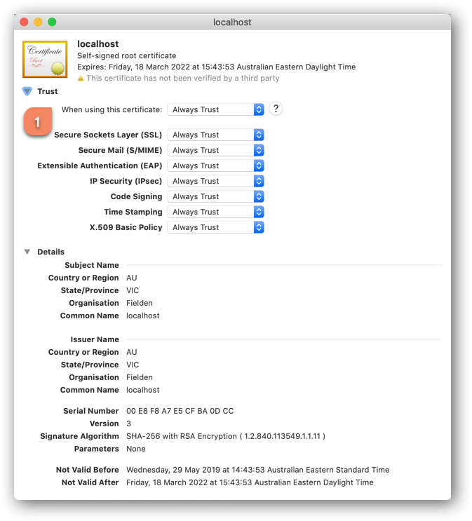

Closing this dialog will prompt for a system password to apply changes. And once applied, entry "localhost" should have a little "+" sign at the start as depicted in the screen capture below.

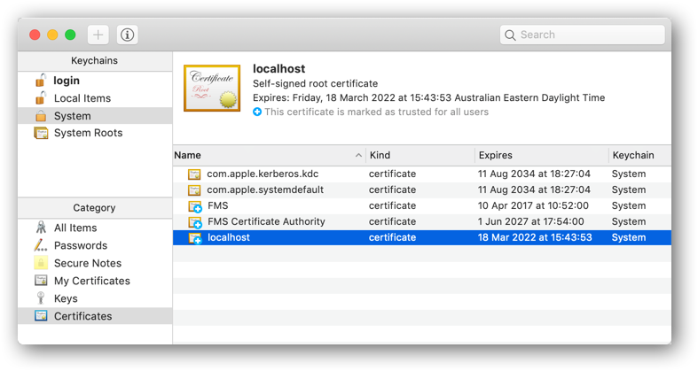

Now close the Keychain Access app, delete file `localhost.cer` as no longer needed and refresh the page in Chrome. The page should load successfully without any privacy exceptions as per the screen capture below.

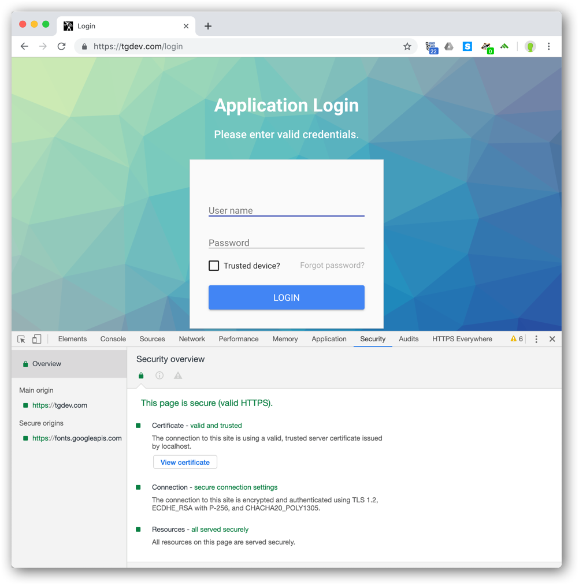

Please note that you might need to restart Chrome for it to load updated certificate policies, but it was not necessary in my case.

### Making certificate trusted in Ubuntu

The situation with Ubuntu is slightly more complicated, but does not requires as many screen captures (:.
First, export the certificate from the certificate dialog, which appears after clicking button "View certificate" (the same as under macOS). The "Export" button is located in tab "Details".

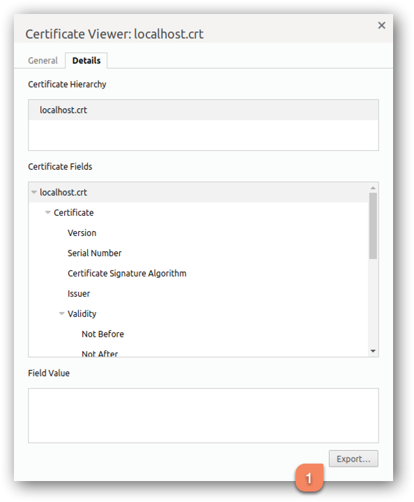

Make sure your select option "single certificate" during the export as indicated in the screen capture below.
Take a note of where the file is exported and the file name -- `localhost.crt`. This is needed for the steps that follow.

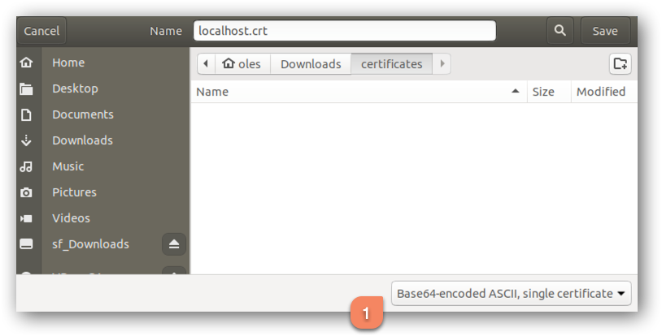

Start a terminal and change the directory to the one where `localhost.crt` has been exported.
Then execute the following commands:

1. `sudo apt-get install libnss3-tools` — install utility `certutil`, which is needed to manage keys and certificates (you only need to install this once, the first time you want to import a certificate).
2. `certutil -d sql:$HOME/.pki/nssdb -A -t "C,," -n localhost.crt -i localhost.crt` — import the certificate into the local database.
3. `certutil -d sql:$HOME/.pki/nssdb -L` — this is just to list what the resultant DB contains to make sure our certificate is present.
4. go to chrome://settings/certificates, find `org-Fielden` in `Authorities` tab, open, edit UNTRUSTED `localhost` to make it trusted

This is it -- refresh the page in Chrome (may need to restart it) and the privacy exception should be no more.

For Firefox users running Linux: Firefox does not have a 'central' location where it looks for certificates. It just looks into the current profile ([reference](https://askubuntu.com/questions/244582/add-certificate-authorities-system-wide-on-firefox)).

2. `certutil -d $HOME/.mozilla/firefox/<YOUR_PROFILE_FOLDER>/ -A -t "C,," -n localhost.crt -i localhost.crt` - import the certificate into the profile DB.
3. `certutil -d $HOME/.mozilla/firefox/<YOUR_PROFILE_FOLDER>/ -L` — this is just to list the profile DB.
4. go to `about:preferences`, find *Certificates* section (in **Security**) and open *View Certificates...*. In the *Authorities* tab the certificate should be present.

### Making certificate trusted in Windows

First, export the `.crt` certificate file from the certificate dialog, which appears after clicking button `View site information` in the Chrome URL field. The `Copy to file` button is located in the tab `Details`. Now you can make it trusted.

1. Start the Microsoft Management Console by running `mmc` command in Powershell.
2. Enter the `File` menu and select `Add/Remove Snap In`.
3. Choose `Certificates Snap-In` and add it to the selected. Choose `Computer account` in the following wizard.

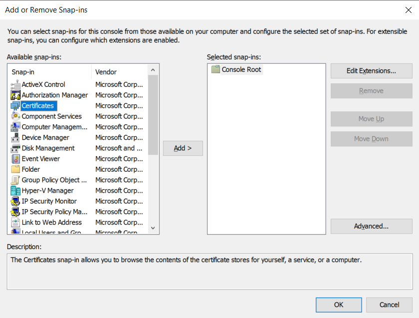

4. Now you can  view your certificates in the MMC snap-in. Select `Console Root` in the left pane, then expand `Certificates (Local Computer)`. Under `Trusted Root Certification Authorities` you can import new certificate file (.crt).

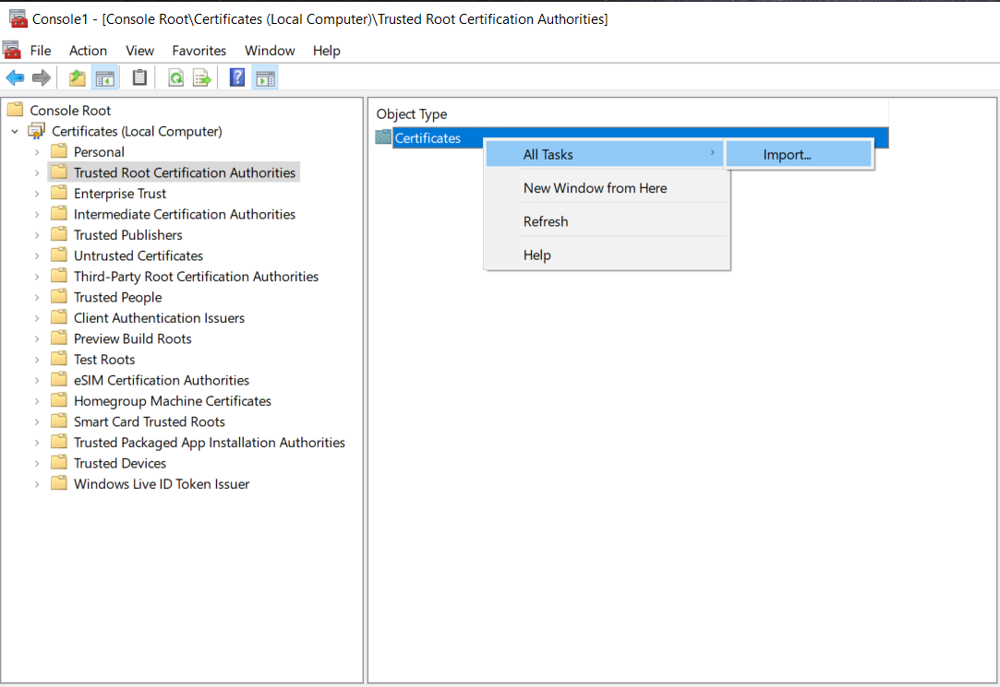

5. Now refresh the Chrome page using `Ctrl+F5`. Things should be fine.

### Making certificate trusted in Android and iOS

1. Generate certificate request from `localhost.pem` and `localhost.key`

`openssl x509 -x509toreq -in localhost.pem -out localhost.csr -signkey localhost.key`

2. Generate `CA.crt` from certificate request with special options

`openssl x509 -req -days 1024 -in localhost.csr -signkey localhost.key -extfile ./android_options.txt -out CA.crt`

 where `android_options.txt` has only one line: `basicConstraints=CA:true`

3. Convert it to DER form

`openssl x509 -inform PEM -outform DER -in CA.crt -out CA.der.crt`

4. Place `CA.der.crt` to Android `/sdcard` location or download file in iOS

5. iOS: `Settings` -> `General` -> `Profile` -> `localhost` -> install it

6. iOS: `Settings` -> `General` -> `Certificate Trust Settings` -> localhost -> enable full trust

7. Android: `Settings` -> `Adittional Settings` -> `Privacy` -> `Credential Storage` -> `Install from storage`

8. Android (check): `Settings` -> `Adittional Settings` -> `Privacy` -> `Credential Storage` -> `Trusted Credentials` -> `User` -> localhost


## Sendria (SMTP server)
All required files are located in [`sendria`](sendria).

The final boss is a simple local SMTP server for receiving email. This can be convenient if you want to reset your password or if your TG application has some logic that actually involves sending email to its users.

Directory `docker` contains a startup script `start_sendria.sh` that will launch the SMTP server, which has a web interface accessible at [http://localhost:1080/](http://localhost:1080/).

That's it! Congratulations on making it this far.


## DBeaver
[DBeaver](https://dbeaver.io) is a graphical database tool that can be used to browse the database structure, observe the changes and execute queries.
We recommned you to make the most out of this tool, since it can help you understand how the running application manages data.

Here is how you connect to a running database instance:

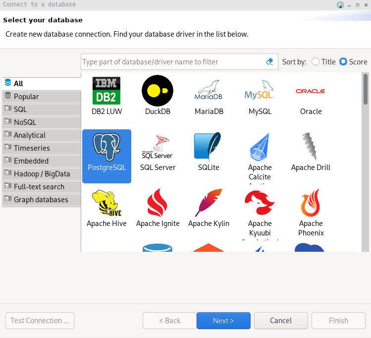

Then you specify connection settings. For example, let's connect to the `tg_local` database that is used for *live data* (as opposed to testing).

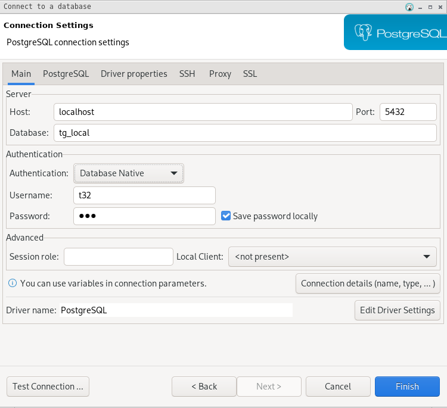

To connect to a test database, set *Database:* to `test_db_N`, where `N` is a number of a database you want to connect to (1 to 4).
Both username and password are `junit`. 
You can find out more simply by browsing the files and reading configurations.
