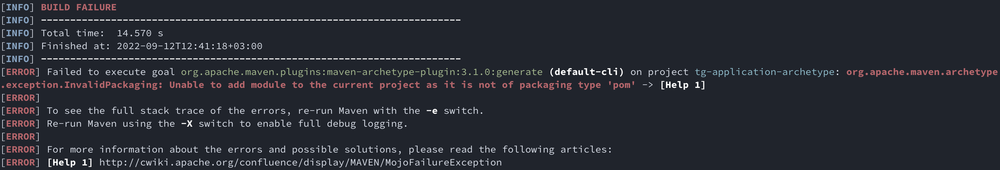

## FAQ

### Initial environment setup

#### TG archetype
If you experience the following error during step 3 (project generation):

Then you are probably running the command while being inside the `tg-archetype` directory. To resolve it you should step out of `tg-archetype` and the cloned repository entirely. Instead go and create a new directory somewhere on your computer, e.g. on your Desktop. Let's say you named it `system-analysis`.

Then, in your terminal go to that newly created directory, e.g. `cd C:\%HOMEPATH%\Desktop\system-analysis` (Windows) or `cd ~/Desktop/system-analysis` (macOS/Linux). Once you are there just run that long command again which generates the project structure.
