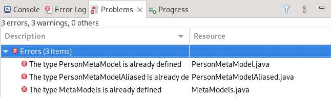
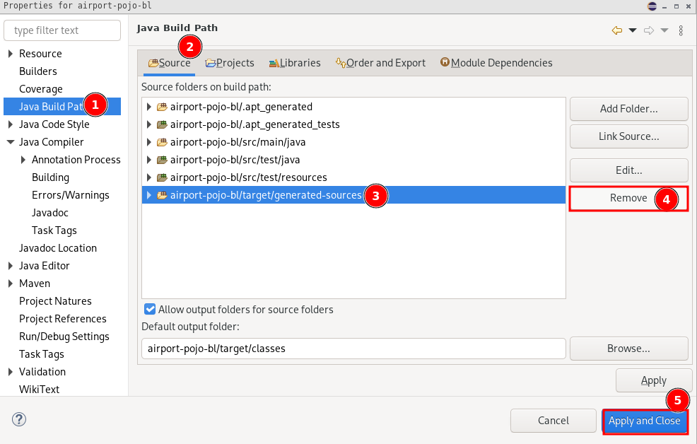

# FAQ

## Initial environment setup

### TG archetype
If you experience the following error during step 3 (project generation):

Then you are probably running the command while being inside the `tg-archetype` directory. To resolve it you should step out of `tg-archetype` and the cloned repository entirely. Instead go and create a new directory somewhere on your computer, e.g. on your Desktop. Let's say you named it `system-analysis`.

Then, in your terminal go to that newly created directory, e.g. `cd C:\%HOMEPATH%\Desktop\system-analysis` (Windows) or `cd ~/Desktop/system-analysis` (macOS/Linux). Once you are there just run that long command again which generates the project structure.

### Eclipse-related problems

#### Build path problem
If you have the following problem in the project `airport-pojo-bl`, then you must have used the `mvn eclipse:eclipse` command, which was later excluded from the instructions for the sake of simplicity.

How to fix it:
1. In *Package Explorer* select `airport-pojo-bl` and right-click, then choose *Properties*.
2. Open *Java Build Path*.
3. In the tab panel select *Source* tab.
4. Select `airport-pojo-bl/target/generated-sources`.
5. Hit *Remove* and *Apply and Close*.

#### MacOS Eclipse canot be opened/quit unexpectedly
Run this command: `sudo codesign --force --sign - /Applications/Eclipse.app`

[Reference](https://stackoverflow.com/questions/70262544/eclipse-quit-unexpectedly-on-macos).

### Docker
Windows user may experience the following issue after installing Docker Desktop - [https://superuser.com/questions/1584710/docker-wsl-2-installation-is-incomplete](https://superuser.com/questions/1584710/docker-wsl-2-installation-is-incomplete).

To resolve it carefully follow these [instructions](https://learn.microsoft.com/en-us/windows/wsl/install-manual#step-1---enable-the-windows-subsystem-for-linux) up to Step 6 (don't follow Step 6). Then restart your computer and launch Docker Desktop again. It should be able to start succesfully.
